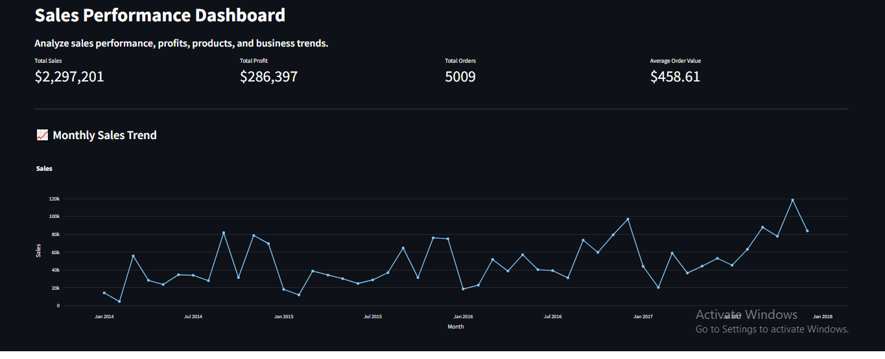
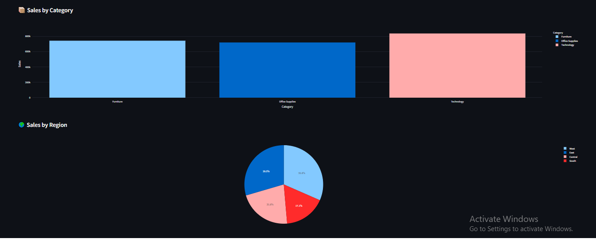
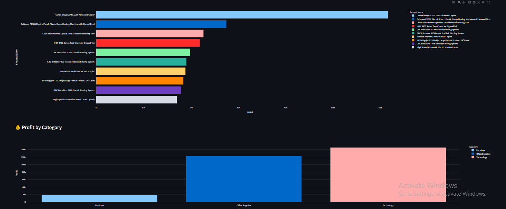

# Task 2 - Sales Performance Dashboard (BNM Tech Solutions)

## Project Overview

The Sales Performance Dashboard is an interactive business intelligence application built using Python, Pandas, Plotly, and Streamlit. The dashboard helps organizations analyze sales performance, monitor profits, evaluate product and category performance, and identify business trends through interactive visualizations.

**Dataset Source :** [Sample - Superstore Dataset](https://www.kaggle.com/datasets/vivek468/superstore-dataset-final)

## Application Screenshots

### Outputs

